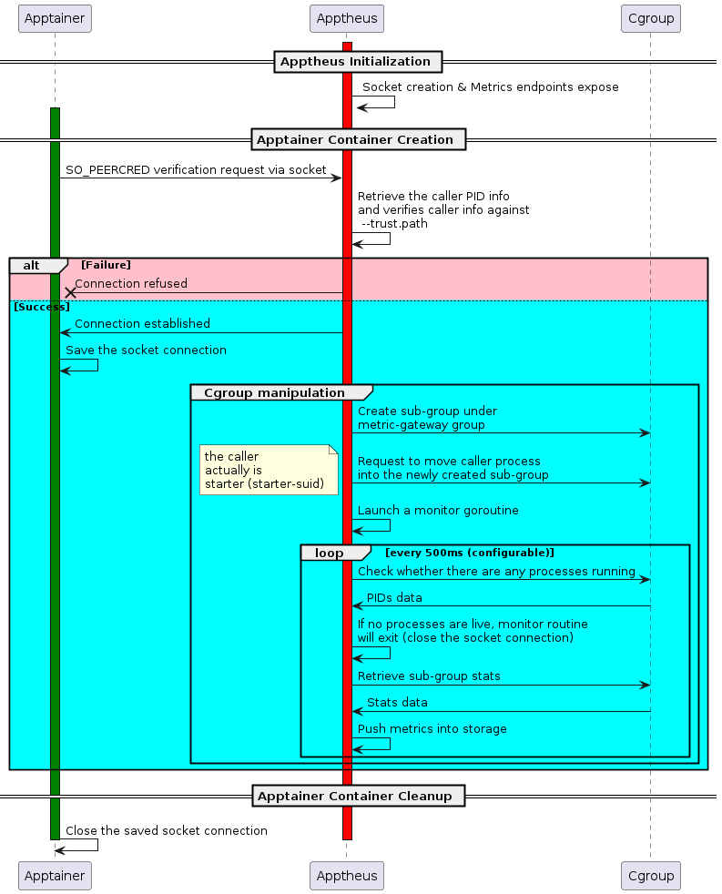

# Apptheus

Apptainer connects Prometheus. A redesigned Prometheus Pushgateway for short-lived jobs.

## Background
Prometheus is an open source metrics collections and monitoring tool that is widely adopted.
> Note: Promethuesnly supports pull model, meaning that Promethues will regularly (`scrape_interval = x`) pull data from metrics sources. If users want to push data to Prometheus, then metric cache components, such as Pushgateway, is needed. See [https://prometheus.io/blog/2016/07/23/pull-does-not-scale-or-does-it/](https://prometheus.io/blog/2016/07/23/pull-does-not-scale-or-does-it/).

Pushgateway acts as a bridge (metric caches, metric sources) to Prometheus targeting at the metrics collection for `short-lived (ephemeral) jobs`. Unlike the normal jobs that Prometheus can easily collect metrics from, short-lived jobs require more flexiable way to push metrics. Pushgateway provides such push and pull features. Any tools can easily push their metrics to it, at the same time, Prometheus can pull metrics data from it. 

> Pushgateway acts a bit of similar to Prometheus exporters [https://prometheus.io/docs/instrumenting/exporters/](https://prometheus.io/docs/instrumenting/exporters/), but Pushgateway is more general and can receive pushed metrics, while exporters are more specialized and do not support pushing metrics.

> When to use Pushgateway (https://prometheus.io/docs/practices/pushing/)

#### Common Prometheus Architecture

> Referenced from [https://www.devopsschool.com/blog/what-is-prometheus-and-how-it-works/](https://www.devopsschool.com/blog/what-is-prometheus-and-how-it-works/)

When we are thinking to collect metrics from Apptainer, several requirements should be satisfied:
1. Less invasion. We do not want to develop a tool that is tightly bound to Apptainer, bringing too much invasion to Apptainer itself.
2. Cgroup stats. We want to use existing Linux feature for metrics collection.
3. Security. Customized security policy that can help verify whether the caller is trusted.
4. Customized push policy. Can freely configure the push interval to sample container metrics.

To provide a unified way of collecting the Apptainer stats data. We need to put starter (starter-suid) program under a created
sub cgroup so that container stats can be collected and visualized. To collect the cgroup stats, we deeply custormized the [Pushgateway](https://github.com/apptainer/apptheus) tool, tailing features and adding additional security policy. We call this new created tool `Apptheus`, meaning Apptainer links to Prometheus.

> Note that this tool can be used for monitoring any programs, this tool comes from the development of one Apptainer RFE.

## Features
1. Disabled the default Pushgateway's push endpoints for security purpose, so users can not directly push the data to Apptheus. Push can only be called via internal function calls.
2. Added a customized verification step, any incoming request through a unix socket will be verified (Check whether the process is trusted one).
3. Apptheus can manipulate the cgroup and put the process into a newly created cgroup sub group and collect cgroup stat.
4. The only available endpoint is:
```
GET /metrics
```
> Note that Apptheus should be started with privileges, which means the unix socket created by Apptheus is also privileged, so during the implementation, the permission of this newly created unix socket is changed to `0o777`, that is also the reason why we need to do additional security check, i.e., checking whether the program is trusted.

## Apptainer uses Apptheus



https://github.com/apptainer/apptheus/assets/2051711/b33c5f20-a030-4b91-a6a7-bc62fe1fc6b8


## Important CLI Options
1. `--socket.path="/run/apptheus/gateway.sock"`, local socket path for verification. Default value is `/run/apptheus/gateway.sock`.
2. `--trust.path=""`, multiple trusted program paths separated using ';', for exmaple, for apptainer starter, the path usually is `/usr/local/libexec/apptainer/bin/starter` .
3. `--monitor.inverval=0.5s`, cgroup stat sample interval.

## Additional Info
1. Presentations on custom metrics with Pushgateway, Prometheus and Grafana (By Nokia) [https://youtu.be/w_jvj0QKrec?si=9ykBj0U03J-b0Z6m&t=2001](https://youtu.be/w_jvj0QKrec?si=9ykBj0U03J-b0Z6m&t=2001)
2. Getting Started with Amazon Managed Service for Prometheus. Amazon has provided users with managed services for Prometheus, allowing users to collect metrics for their containers. [https://aws.amazon.com/blogs/mt/getting-started-amazon-managed-service-for-prometheus/](https://aws.amazon.com/blogs/mt/getting-started-amazon-managed-service-for-prometheus/)
3. Other tools also uses Pushgateway and Prometheus
- [https://doc.arroyo.dev/introduction#metrics](https://doc.arroyo.dev/introduction#metrics)
- [https://deckhouse.io/documentation/v1.49/modules/303-prometheus-pushgateway/examples.html](https://deckhouse.io/documentation/v1.49/modules/303-prometheus-pushgateway/examples.html)
- [https://docs.dapr.io/operations/observability/metrics/prometheus/](https://docs.dapr.io/operations/observability/metrics/prometheus/)
4. Other tech blogs
- Monitoring dashboard for AWS ParallelCluster. [https://noise.getoto.net/tag/aws-parallelcluster/](https://noise.getoto.net/tag/aws-parallelcluster/)
- Springboot Actuator marks Prometheus as production ready feature. [https://docs.spring.io/spring-boot/docs/current/reference/html/actuator.html](https://docs.spring.io/spring-boot/docs/current/reference/html/actuator.html)
- Prometheus Monitoring at Scale: War Stories from the GumGum Trenches. [https://medium.com/gumgum-tech/prometheus-monitoring-at-scale-war-stories-from-the-gumgum-trenches-f66393c52d0a](https://medium.com/gumgum-tech/prometheus-monitoring-at-scale-war-stories-from-the-gumgum-trenches-f66393c52d0a)
- Pushgateway and Prometheus Transform Data Collection and Analysis. [https://www.cloudthat.com/resources/blog/pushgateway-and-prometheus-transform-data-collection-and-analysis](https://www.cloudthat.com/resources/blog/pushgateway-and-prometheus-transform-data-collection-and-analysis)